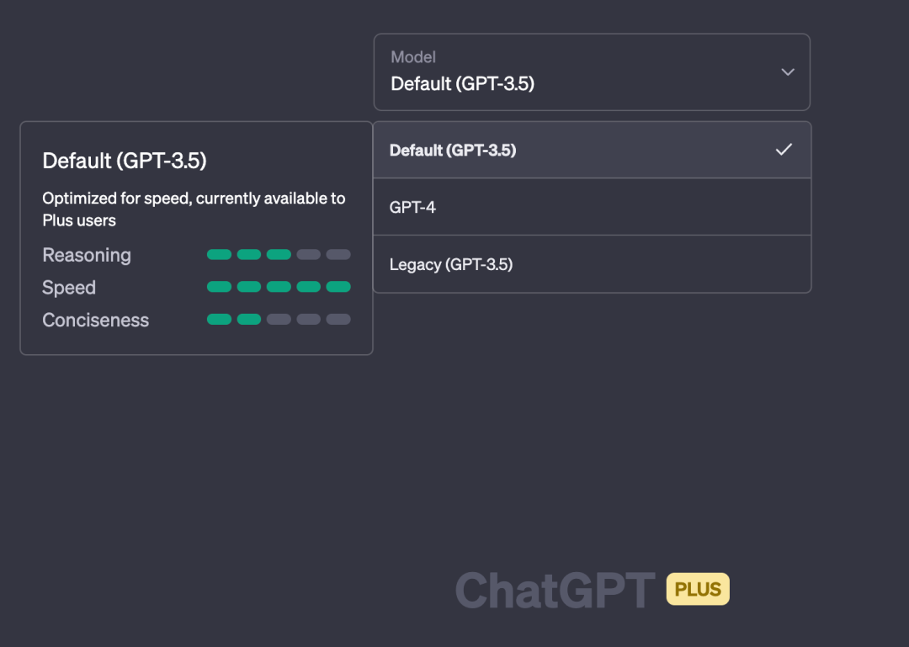

# GPT3.5 vs GPT4.0

## GPT 3.5 和 GPT 4.0 的区别

1. GPT 3 和 GPT4 的最大不同之处在于规模，GPT3 拥有 175B 参数，而 GPT4 拥有 3.3T 参数，可以有效地解决复杂语言任务。
2. 另一个重要的不同之处在于 GPT4 使用了树型推理（Tree-Based Reasoning）来完成建模，这使得 GPT4 更加稳定、精确、高效。GPT4 的模型可以有效地解决自然语言交互（NLU）和自然语言理解（NLU）等复杂 NLP 任务。
3. 更创造性的写作能力，包括编歌曲、写剧本、学习用户写作风格
4. 可以接受图片输入（暂不可用）、并生成字幕等
5. 可以处理超过 25000 字长文本
6. 智能程度大幅提升。以美国 BAR 律师执照统考为例：GPT3.5 可以达到 10% 水平分，GPT4 可以达到 90% 水平分。生物奥林匹克竞赛从 GPT3.5 的 31% 水平分，直接飙升到 99% 水平分，国际奥赛金奖水准。

## 模型对比提升

1. 模型规模

  GPT4 和 GPT3.5 的主要区别在于模型的规模。GPT4 预计将拥有超过 100 万亿个参数（1e+15），而 GPT3 只有 1750 亿个参数（1.75e+11）。这意味着 GPT4 可以处理更多的数据，生成更长、更复杂、更连贯、更准确、更多样化和更有创造力的文本。

2. 模型能力

  由于模型规模的提升，GPT4 也展现出了比 GPT3.5 更强大的能力。例如，在各种专业和学术考试中，如 SAT、LSAT、GRE 等，GPT4 都表现出了与人类水平相当或超越的性能；而在日常对话中，也能够与人类进行流畅、自然、合理、有趣且富有逻辑性的交流。

3. 模型输入

  另一个重要的区别是，GPT4 是一个多模态（multimodal）模型，即它可以接受图像和文本作为输入，并输出文本；而 GPT3.5 只能接受文本作为输入，并输出文本。这使得 GPT4 可以处理更复杂且具有视觉信息的任务，如图像描述、图像问答、图像到文本等。

4. 模型训练

  最后一个区别是，由于数据量和计算资源的限制，目前没有公开发布完整版的 GPT4 或者其训练代码；而 OpenAI 已经公开了部分版本（如 Davinci）以及其 API 接口供用户使用或测试。

## 实测结果

现在国内很多平台号称可以使用 GPT4，而实际上是能申请到 GPT 4 API 调用权限的开发者极少，<strong>「很多都是 GPT 3.5 冒充的」</strong>。使用下面几个问题可以辨别 GPT 3.5 和 GPT 4。 可以看到 GPT 4 的回答更加“智能”，也更加准确，GPT 4 会尝试从更多角度去思考。

### GPT 3.5

### GPT 4.0

可以看到第一二个问题 GPT 3.5 和 GPT 4 回答得都差不多，但后面两个问题，GPT 4 的表现明显更好一些。

## 优劣势及适用场景

### GPT3.5 的优势及适用场景

GPT 3.5 相比于 GPT4 最大的优势就是<strong>「便宜」</strong>。在一些不追求准确性、不需要复杂推理的场景，使用 GPT 3.5 可能是更好的选择，比如：文案创作、思维导图梳理、闲聊、一眼就能知道答案正确与否的（比如让写一个 bash 命令或者创建sql）。

除此之外，GPT 3.5 的另一个优势是它可能更快。官网针对 plus 用户对 GPT 3.5 做了速度优化，比 GPT 4 响应更快。

### GPT4 的优势及适用场景

GPT4 的主要优势是<strong>「答案更加准确」</strong>，大大降低了 GPT 3.5 那种一本正经说胡话的概率。但相对于 GPT 3.5 来说，GPT4 的 API 要贵很多（是 GPT 3.5 的 20-30 倍）。而官网的 plus 会员也是高达 20 美金一个月，而且 3 个小时只能问 25 个问题。

GPT4 的适用场景是需要更加正确地回答的问题，比如需要理解更复杂的上下文，或者在一些比较强的专业领域。目前我自己的实践是先用 3.5 问一遍，如果得不到满意的回答，就会使用 GPT4 再问问，有时候会得到自己想要的答案。但实测下来其实很多问题差距不会太大。