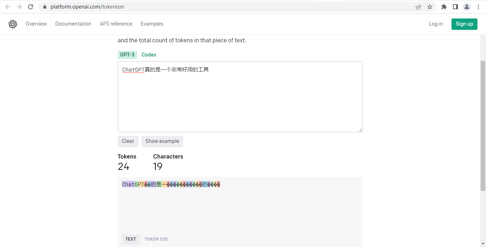

# Token 费用

ChatGPT API 是 OpenAI 提供的可以让我们调用 GPT 模型的接口，所以更准确的说法应该是 OpenAI API。

- 那么 ChatGPT API 的收费标准是什么呢？
- 1 美元有多少 token？
- 一个中文汉字/英文字符又占多少 token 呢？

这篇文章就分享下 ChatGPT API 的收费标准，以及如何计算 Token。	

## 一、OpenAI ChatGPT API 收费标准

OpenAI ChatGPT API是收费的，不同模型（如 GPT-3.5、GPT-4.0 等）的收费标准不一样，以下是 OpenAI 官方最新（2023年7月）的 API 价格。

### 1、GPT-3.5 Turbo API 价格

| 模型 | 输入 | 输出 |
| ------- | ------- | ------- |
| 4000 字上下文 | $0.0015 / 1000 tokens | $0.002 / 1000 tokens |
| 16000 字上下文 | $0.003 / 1000 tokens | $0.004 / 1000 tokens |

### 2、GPT-4 API 价格

| 模型 | 输入 | 输出 |
| ------- | ------- | ------- |
| 8000 字上下文 | $0.03 / 1000 tokens | $0.06 / 1000tokens |
| 32000 字上下文 | $0.06 / 1000 tokens | $0.12 / 1000 tokens |

可以看到 GPT-4 API 价格几乎是 GPT-3.5 API 价格的 20 倍。

## 二、OpenAI ChatGPT API Token 计算方式

在 OpenAI ChatGPT API 收费标准中，有一个计算单位：Token。

- 那么一个 token 到底是多少呢？
- 一个中文汉字算多少 token？
- 一个英文字符算多少 token？
- 一个英文单词又是多少 token？

概括的讲：
- 1000 tokens 大概是 750 个英文单词
- 1000 tokens 大概是 500 个中文汉字
- 1000 tokens 0.002 美元

总体来讲 OpenAI ChatGPT API 价格还是合理的。

OpenAI 也提供了在线工具让大家计算使用 token：https://platform.openai.com/tokenizer

如下图所示：英文单词 “ChatGPT” 占用 3 个 token，“AI” 占用 1 个 token，有的中文汉字（如图中的 “的”、“是”、“一” 等）占用 1 个 Token，但是大部分的中文汉字（乱码的）都是占用 2 个 token。

