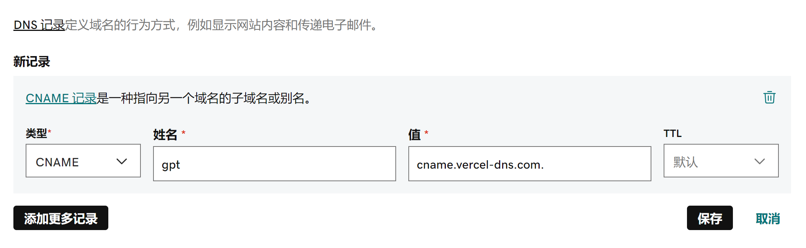

# 私人 ChatGPT

## TL;DR

私人 ChatGPT 解决了国内访问 ChatGPT 的问题，但 ChatGPT 账号的注册流程还是比较复杂繁琐的，因此，作者提供了一个简单快捷的试用平台，可以直接体验 ChatGPT。

你只需要支付消耗 token 的相关费用即可，需要请联系：xxx。

## 为什么要部署私人 ChatGPT？

国内市场上已经有很多 ChatGPT 镜像网站，那么为什么我们还要重复造轮子呢？原因不外乎以下几点：

- 市场上很多 ChatGPT 限制了大家使用次数，次数用完就要收费，妥妥地割韭菜。
- 有些站点是让你填 OpenAI 的 API key，但是将 API key 填入别人的站点，不安全。
- 最主要的是不稳定，可能用着用着就不能访问了，我之前收藏的站点现在没几个能用的。

所以，不如自己折腾一个私人专属的 ChatGPT 网站，也可以分享给你的好友，用的舒心，玩的放心。

## 技术选型

Github + Vercel

## Vercel 是什么？

[Vercel](https://vercel.com/) 是一个免费的网站托管平台，可以部署静态网站，也可以部署动态网站，主要优点：

- 可关联 Github，只需要往 Github 提交代码，它会自动获取最新的提交，然后自动部署
- 提供免费域名，如果有自己的域名，你可以将域名解析到这个平台
- 提供免费的 HTTPS 证书
- 傻瓜式部署方式，支持命令行部署和管理后台部署

## 部署

一、Fork [ChatGPT-Next-Web](https://github.com/Yidadaa/ChatGPT-Next-Web) 项目到自己的 Github 账号中

二、注册 [Vercel](https://vercel.com/) 账号，这里建议直接用 Github 授权登录即可。

三、新建项目

1. 进入 [Vercel](https://vercel.com/) 控制台首页；
2. 点击 Add New；
3. 选择 Project。

1. 在 Import Git Repository 处，搜索 chatgpt-next-web；
2. 选中新 fork 的项目，点击 Import。

1. 在项目配置页，点开 Environmane Variables 开始配置环境变量；
2. 依次新增名为 OPENAI_API_KEY 和 CODE (访问密码) 的环境变量；
3. 填入环境变量对应的值；
4. 点击 Add 确认增加环境变量；
5. 请确保你添加了 OPENAI_API_KEY，否则无法使用；
6. 点击 Deploy，创建完成，耐心等待 5 分钟左右部署完成。

四、增加自定义域名

如果你有自己的域名，那你还可以通过配置将自己的域名解析到这个网站上来。

1. 进入该项目主页，点击 Domians

2. 点击 Edit

3. 输入你的域名

4. 配置 CNAME

去域名购买的服务商后台配置一个 CNAME，输入的值就是下面圈出来的部分

godaddy 示例：

## 如何更改环境变量

1. 进去 Vercel 项目内部控制台，点击顶部的 Settings 按钮；
2. 点击左侧的 Environment Variables；
3. 点击已有条目的右侧按钮；
4. 选择 Edit 进行编辑，然后保存即可。

⚠️️ 注意：每次修改完环境变量，你都需要重新部署项目来让改动生效！

## 重新部署

1. 进入 Vercel 项目内部控制台，点击顶部的 Deployments 按钮；
2. 选择列表最顶部一条的右侧按钮；
3. 点击 Redeploy 即可重新部署。