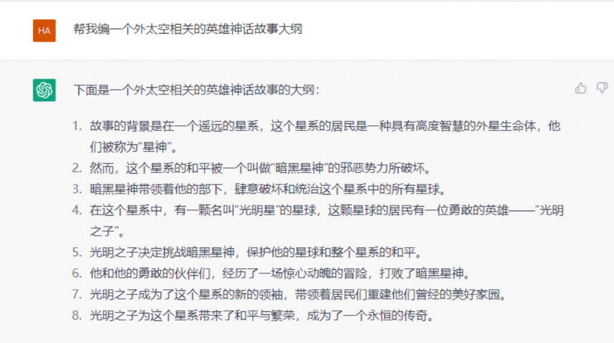

# ChatGPT 注册使用

## TL;DR

ChatGPT 的注册流程还是比较复杂繁琐的，因此，作者提供了一个简单快捷的试用平台，可以直接体验 ChatGPT。

你只需要支付消耗 token 的相关费用即可，需要请联系：xxx。

## ChatGPT 是什么

ChatGPT 是由 OpenAI 开发的一种大型语言模型，可以用于回答各种问题、生成文本、进行对话等自然语言处理任务。

简单来说，ChatGPT 就是最新一代通用型超强 AI，拥有庞大的知识库，能够回答各种各样的问题。有什么问题，问 ChatGPT 就行了！

ChatGPT 由 OpenAI 在 2022 年 11 月 30 号发布，发布 5 天后全球用户数就超过了 100w。

## ChatGPT 官网

ChatGPT的官方网址是 https://chat.openai.com
 
请认准其官方域名 [openai.com](https://openai.com/)，不是这个域名的ChatGPT服务都是镜像站或者假冒伪劣网站，请注意辨别。（国内山寨版本很多）

## 如何注册 ChatGPT 使用流程

这么强大的工具我们都想体验一下，那么 ChatGPT 怎么用呢？接下来将给你逐步详细介绍。

使用 ChatGPT 主要有4步：

1. 注册 ChatGPT 账号
2. 注册需要一个外国手机号码：通过短信接码平台 [sms-activate.org](https://sms-activate.org) 完成 ChatGPT 手机号验证
3. 登录 ChatGPT 账号，对话框输入，开始使用 ChatGPT ！ 
4. 输入任意问题，探索 ChatGPT 的强大功能

好了，我们开始逐步图文介绍。

### 1. 注册 ChatGPT 账号

注冊 ChatGPT 这一步主要包含以下几步（需要按照顺序逐步操作）：

1. 将网络环境切换成国外 IP（注意：必须是国外 IP如美国、加拿大，日本，新加坡等 openai 支持的国家，香港澳门 IP 是不行的），且后续整个注册流程都必须在此网络环境下进行。
2. 打开官方注册 https://chat.openai.com/auth/login 链接并使用自己的邮箱进行账号注册（网易，outlook 邮箱不行，必须要 gmail 等国外邮箱，outlook 以前可以，现在不行了）
3. 打开邮箱查收 OpenAI 账号验证邮件，点击验证按钮完成邮箱验证

下面每一个步骤的图片，大家可以对照着进行操作

邮箱验证完成后，我们第一步注册 ChatGPT 账号就算完成了，但是到这里我们还不能开始使用 ChatGPT，因为我们还需要进行外国手机号码验证。没有通过手机号码验证是使用不了 OpenAI（ChatGPT的开发商） 的服务的。

因为 OpenAI 官方的限制，国内和港澳的手机号码还有 Google Voice 的虚拟号码都是不能使用的。

这时候就要用到下一步的接码平台。

### 2. 完成 ChatGTP 手机号码验证
这一步需要用到接码平台完成手机号验证，推荐平台链接地址：[sms-activate.org](https://sms-activate.org)

具体过程包含以下几步：

1. 通过自己的邮箱注册 [sms-activate.org](https://sms-activate.org) 账号并完成邮箱验证（其他接码平台同理，但是不一定每个都好用，[sms-activate.org](https://sms-activate.org) 是博主亲自验证过的）
2. 打开邮箱查收验证邮件并点击确认完成 [sms-activate.org](https://sms-activate.org) 账号认证
3. 登录 [sms-activate.org](https://sms-activate.org) 并且在右上角找到充值按钮，点击进行充值
4. 点击充值跳转后，往下滑找到支付宝，这里建议大家充值 1 美金就可以了（不够用再充）。
5. 充值好了以后回到首页搜索「open」关键字就可以找到 OpenAI 验证码的临时号码购买链接。
6. 在右侧激活区看到待使用的临时号码，将此号码复制到 OpenAI 的验证码接收区里面。
7. 在 OpenAI 的页面点击发送验证码，这样就可以在接码平台接收到验证码（有时候有一点慢需要耐心等待一下），将验证码填进去，这样就完成 ChatGPT 手机号验证了。

这一步比较长，但是操起其实也不复杂，简单说就是通过接码平台收验证码完成验证。（ps：6 月份以后注册难度增加，就是可能会失败，比如号码失效，标记你的邮箱无法注册等）

下面是每一步的操作图，大家可以对照操作。

打开邮箱找到验证邮件

历经千辛万苦，我们终于可以开始使用 ChatGPT 啦，恭喜！

### 3. 登录 ChatGPT 账号并开始使用

注册成功后，有了官方账号，我们就可以直接去 ChatGPT 网站去登陆使用： https://chat.openai.com/auth/login

输入账号密码就可以成功登录。
 
登录以后我们会进入到 ChatGPT 的主界面，在屏幕的正下方就是我们使用 ChatGPT 的输入对话框，ChatGPT 采用交互式对话界面，使用非常便捷友好，你可以任意输入你感兴趣的内容并敲回车，ChatGPT 将会回答你。

比如我们问一下 ChatGPT 梯形相关的问题，看看他会怎么回答。

到这里，你已经学会了如何使用 ChatGPT 了！

### 4. 探索 ChatGPT 的强大功能

你可以尝试用各种方式向 ChatGPT 提出各种各样的问题或者指令，通过这一步你将更能体会到 ChatGPT 的强大之处。来吧，朋友，让我们真正学会 Chat GPT 怎么用。

比如：

- 叫 ChatGPT 写一首诗

- 叫 ChatGPT 写代码

- 叫 ChatGPT 进行翻译

- 叫 ChatGPT 编故事

好啦，到这里为止，我们已经一步步教会了你怎麽注冊 ChatGPT账号，怎么通过 ChatGPT 手机号验证，怎么用 ChatGPT。

祝大家玩的愉快！